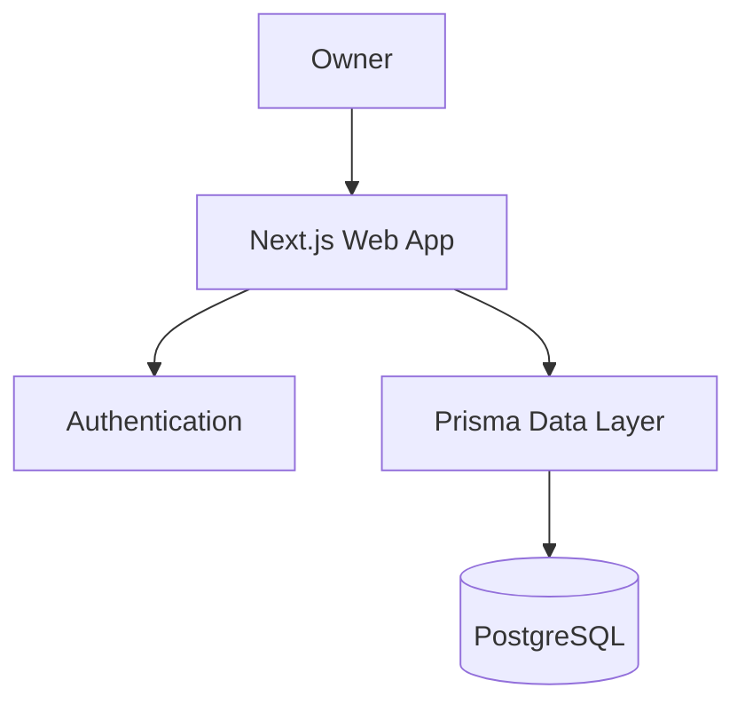
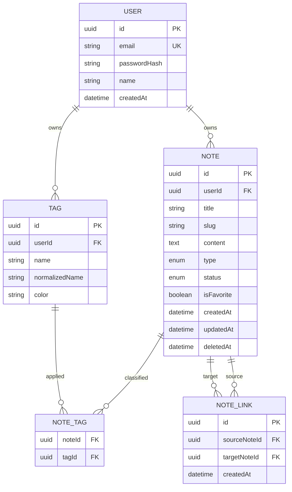

# Arsitektur Teknis — Second Brain 1.0

## 1. Prinsip arsitektur

- Satu aplikasi full-stack agar MVP mudah dikembangkan dan di-deploy.
- Server menjadi sumber kebenaran untuk autentikasi, validasi, dan authorization.
- UI tidak mengakses database secara langsung.
- Struktur kode berbasis fitur agar notes, tags, links, dan search mudah dirawat.
- Desain database tetap memiliki `userId` agar migrasi ke multi-user tidak mahal.

## 2. Stack awal

| Lapisan | Pilihan |
|---|---|
| Runtime/web framework | Next.js App Router + TypeScript |
| UI | React, Tailwind CSS, komponen aksesibel |
| Form dan validasi | React Hook Form + Zod |
| Database | PostgreSQL |
| ORM/migration | Prisma |
| Authentication | Auth.js atau implementasi session berbasis library matang |
| Unit/integration test | Vitest |
| End-to-end test | Playwright |
| Deployment | Vercel dan PostgreSQL terkelola |
| CI | GitHub Actions |

Versi dependency akan dikunci pada saat inisialisasi berdasarkan versi stabil, kemudian disimpan di lockfile.

## 3. Diagram konteks



## 4. Struktur aplikasi yang disarankan

```text
src/
  app/
    (auth)/
      login/
    (app)/
      dashboard/
      inbox/
      notes/
      tags/
      search/
      archive/
    api/
  components/
    ui/
    layout/
  features/
    auth/
    notes/
    tags/
    links/
    search/
  lib/
    auth/
    db/
    validation/
    utils/
  styles/
prisma/
  schema.prisma
  migrations/
tests/
  e2e/
```

Route hanya mengatur HTTP/rendering. Aturan bisnis, schema validasi, query, dan mapping data ditempatkan pada modul fitur terkait.

## 5. Model data konseptual



### Constraint penting

- `User.email` unik.
- `(Note.userId, Note.slug)` unik.
- `(Tag.userId, Tag.normalizedName)` unik.
- `(NoteTag.noteId, NoteTag.tagId)` unik.
- `(NoteLink.sourceNoteId, NoteLink.targetNoteId)` unik.
- Pembuatan `NoteLink` memverifikasi source dan target dimiliki user yang sama.
- Index dibuat untuk `Note.userId`, `status`, `updatedAt`, `isFavorite`, serta field pencarian.

## 6. Kontrak operasi aplikasi

Implementasi dapat memakai Server Actions untuk mutasi internal dan Route Handlers untuk endpoint yang memang perlu diekspos. Apa pun mekanismenya, kontrak logis berikut harus tersedia.

| Operasi | Input utama | Output |
|---|---|---|
| Login | email, password | sesi owner |
| Quick capture | content, optional source URL | note `INBOX` |
| Create note | title, content, type, tags | note baru |
| List notes | query, status, type, tags, page | hasil paginated |
| Get note | id/slug | detail, tags, links, backlinks |
| Update note | id + perubahan field | note terbaru |
| Archive/restore | id + target status | note terbaru |
| Create/delete tag | tag payload/id | tag/result |
| Link/unlink note | sourceId, targetId | link/result |

### Format error konsisten

```json
{
  "error": {
    "code": "VALIDATION_ERROR",
    "message": "Data yang dikirim belum valid.",
    "fields": {
      "title": ["Judul wajib diisi untuk note aktif."]
    }
  }
}
```

Pesan internal database tidak boleh dikirim langsung ke browser.

## 7. Search

Tahap pertama menggunakan PostgreSQL full-text search atau pencarian terindeks yang mendukung judul dan konten. Ranking mengutamakan kecocokan judul, lalu isi, kemudian waktu pembaruan sebagai tie-breaker. Search selalu dibatasi `userId` dan mengecualikan soft-deleted note.

Semantic/vector search ditunda sampai terdapat data dan kebutuhan nyata.

## 8. Security baseline

- Hash password menggunakan algoritma password hashing yang matang; tidak menggunakan SHA-256 biasa.
- Secret hanya berada di environment variable dan `.env*` tidak pernah di-commit.
- Validasi request dilakukan di server dengan schema eksplisit.
- Authorization diperiksa pada setiap operasi berbasis resource.
- Konten Markdown disanitasi sebelum dirender.
- Login diberi rate limiting ketika aplikasi dapat diakses publik.
- Error log tidak menyimpan password, session token, atau isi note.
- Dependency audit dan secret scan dijalankan dalam CI.

## 9. Strategi pengujian

| Level | Fokus |
|---|---|
| Unit | normalisasi tag, slug, aturan status, validasi, mapping error |
| Integration | repository/service notes, ownership, note link, filter/search |
| E2E | login, quick capture, process Inbox, tag, link/backlink, search, archive |
| Manual | responsive, keyboard, focus, dark mode, empty/error/loading state |

## 10. Environment

| Environment | Tujuan | Database |
|---|---|---|
| Local | Pengembangan harian | PostgreSQL lokal atau container |
| Test | Test otomatis | Database test terpisah |
| Preview | Verifikasi pull request | Database preview/staging |
| Production | Pemakaian nyata | PostgreSQL terkelola dengan backup |

Migrasi production harus dijalankan sebagai langkah deployment terkontrol, bukan `db push` tanpa riwayat.
