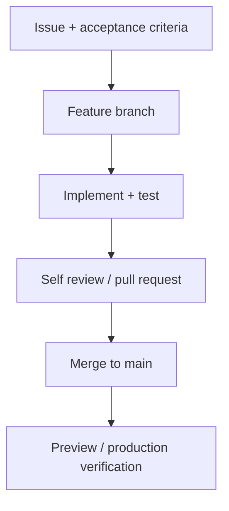

# Roadmap Pembangunan — Second Brain 1.0

Roadmap menggunakan milestone berbasis hasil. Estimasi diasumsikan untuk pengerjaan sambilan oleh satu developer; waktu aktual dapat berubah.

## Milestone 0 — Product baseline

Estimasi: 1–2 sesi

- Setujui SRS dan batas MVP.
- Putuskan nama/branding sementara.
- Pilih metode login dan penyedia database untuk staging.
- Buat wireframe low fidelity halaman utama.
- Buat GitHub repository dan issue board.

Output: baseline dokumen dan backlog yang siap dikerjakan.

## Milestone 1 — Project foundation

Estimasi: 2–3 sesi

- Inisialisasi Next.js + TypeScript.
- Setup Tailwind, lint, format, absolute imports, dan environment validation.
- Setup PostgreSQL dan Prisma.
- Tambahkan layout dasar serta komponen UI inti.
- Setup Vitest, Playwright, dan GitHub Actions.

Output: aplikasi dapat dijalankan, diuji, dan dibuild tanpa error.

## Milestone 2 — Authentication

Estimasi: 2–3 sesi

- Buat model User dan seed owner.
- Implement login, session, route protection, dan logout.
- Tambahkan rate limit strategy serta error handling.
- Buat test autentikasi.

Output: hanya owner yang dapat masuk ke area aplikasi.

## Milestone 3 — Notes dan Inbox

Estimasi: 5–7 sesi

- Buat model dan migration Note.
- Implement quick capture.
- Implement list, detail, create, edit, archive, dan restore.
- Tambahkan editor serta preview Markdown aman.
- Implement pagination, sorting, state UI, dan test.

Output: lifecycle note berfungsi dari capture sampai archive.

## Milestone 4 — Tags dan connections

Estimasi: 3–5 sesi

- Buat Tag, NoteTag, dan NoteLink.
- Implement create/rename/delete tag.
- Implement filter tag.
- Implement related notes dan backlinks.
- Uji unique constraint, ownership, dan self-link.

Output: knowledge dapat dikelompokkan dan saling dihubungkan.

## Milestone 5 — Search dan review dashboard

Estimasi: 3–5 sesi

- Implement full-text search dan filter URL.
- Buat dashboard counts, recent notes, favorites, dan quick capture.
- Tambahkan loading, empty, dan error state.
- Uji performa pada seed dataset besar.

Output: note mudah ditemukan dan Inbox mudah ditinjau.

## Milestone 6 — Quality dan release

Estimasi: 3–4 sesi

- Audit responsive design dan accessibility.
- Lengkapi E2E test alur kritis.
- Review authorization, sanitasi Markdown, secret, dan error logging.
- Siapkan staging/production database serta migration workflow.
- Deploy, smoke test, dokumentasikan backup/restore.
- Perbarui README dengan screenshot, arsitektur, dan demo.

Output: MVP production-ready dan layak menjadi portofolio.

## Prioritas backlog

### P0 — wajib untuk MVP

- Auth owner.
- Quick capture dan Inbox.
- Note CRUD dan Markdown.
- Tags.
- Note links/backlinks.
- Search.
- Archive/restore.
- Responsive dan keamanan dasar.

### P1 — setelah P0 stabil

- Favorite.
- Keyboard shortcuts/command palette.
- Statistik dashboard lebih kaya.
- Autosave draft.

### P2 — kandidat versi berikutnya

- AI summary dan semantic search.
- Attachment dan OCR.
- Import/export.
- Daily notes.
- Web clipper.
- PWA/offline.

## Workflow tiap fitur

## Definition of Release 1.0

- Seluruh requirement Must dan P0 selesai.
- Tidak ada bug severity critical/high yang terbuka.
- E2E test alur kritis lulus.
- Build, migration, dan deployment dapat diulang.
- Backup database aktif dan restore procedure terdokumentasi.
- README berisi fitur, stack, setup, arsitektur, screenshot, dan demo URL.
