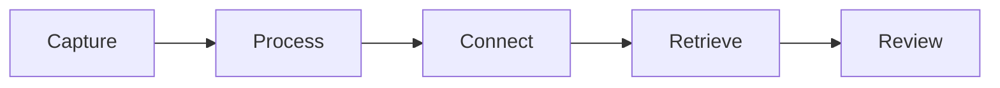

# Software Requirements Specification — Second Brain 1.0

Versi dokumen: 1.0  
Status: Draft untuk baseline MVP  
Pemilik produk: Andhika  

## 1. Pendahuluan

### 1.1 Tujuan

Dokumen ini menjadi acuan kebutuhan, batas pekerjaan, dan kriteria penerimaan Second Brain 1.0. Dokumen dipakai untuk mencegah scope creep dan menjadi dasar desain, implementasi, pengujian, serta demo portofolio.

### 1.2 Masalah yang diselesaikan

Pengetahuan pribadi sering tersebar di chat, bookmark, dokumen, dan catatan lepas. Informasi mudah ditangkap tetapi sulit ditemukan kembali, tidak saling terhubung, dan jarang ditinjau. Second Brain menyediakan satu alur sederhana:

### 1.3 Sasaran produk

- Memungkinkan ide atau referensi disimpan dalam kurang dari 30 detik.
- Menjaga catatan yang belum dirapikan tetap terlihat melalui Inbox.
- Membantu pengguna menemukan kembali catatan melalui pencarian, tag, dan hubungan antarnote.
- Memberikan pengalaman yang bersih dan nyaman untuk penggunaan pribadi setiap hari.
- Menghasilkan proyek full-stack yang layak menjadi portofolio.

### 1.4 Istilah

| Istilah | Arti |
|---|---|
| Owner | Satu-satunya pengguna yang berhak mengakses aplikasi |
| Note | Unit utama pengetahuan berisi judul dan konten Markdown |
| Inbox | Kumpulan note yang baru ditangkap dan belum diproses |
| Process | Tindakan merapikan judul, isi, tipe, dan tag note |
| Tag | Label untuk mengelompokkan note |
| Note link | Hubungan terarah antara dua note |
| Backlink | Hubungan masuk dari note lain |
| Archive | Note yang disimpan tetapi tidak tampil dalam daftar aktif |

## 2. Ruang lingkup

### 2.1 Termasuk dalam MVP

- Login aman untuk satu owner.
- Quick capture ke Inbox.
- CRUD note dengan editor Markdown dan preview.
- Tipe note: `NOTE`, `IDEA`, `ARTICLE`, dan `REFERENCE`.
- Status note: `INBOX`, `ACTIVE`, dan `ARCHIVED`.
- Tags dan pemfilteran berdasarkan tag.
- Favorite/pin note penting.
- Hubungan manual antarnote serta daftar backlink.
- Pencarian judul dan isi note.
- Dashboard ringkas untuk Inbox, note terbaru, favorite, dan statistik dasar.
- Arsip serta pemulihan note.
- Responsive layout dan dark mode.
- Validasi input, error state, empty state, loading state, dan notifikasi hasil aksi.

### 2.2 Di luar MVP

- Tasks, calendar, habit tracker, dan project management.
- Chat AI, embedding, semantic search, serta rangkuman AI.
- Kolaborasi, sharing publik, komentar, dan workspace tim.
- Attachment file, OCR, web clipper browser extension, serta sinkronisasi offline.
- Mobile app native.
- Import massal dari Notion/Obsidian dan ekspor penuh.

Fitur di luar MVP dapat masuk versi 1.1 atau 2.0 setelah penggunaan nyata menunjukkan kebutuhannya.

## 3. Pengguna dan hak akses

### 3.1 Persona utama

Andhika adalah programmer yang ingin menyimpan pengetahuan teknis, ide proyek, hasil belajar, referensi, dan catatan kerja agar mudah dicari kembali.

### 3.2 Aturan akses

- Sistem hanya memiliki satu role: `OWNER`.
- Tidak ada halaman registrasi publik.
- Seluruh halaman aplikasi selain login memerlukan sesi valid.
- Seluruh query note, tag, dan link wajib dibatasi dengan `userId`, walaupun MVP hanya memiliki satu pengguna. Ini memudahkan pengembangan multi-user di masa depan.

## 4. Kebutuhan fungsional

Prioritas menggunakan Must, Should, dan Could. Hanya kebutuhan Must yang menentukan kelulusan MVP.

### 4.1 Autentikasi

| ID | Prioritas | Kebutuhan | Acceptance criteria |
|---|---|---|---|
| FR-AUTH-01 | Must | Owner dapat login menggunakan email dan password | Kredensial valid membuat sesi dan membuka Dashboard; kredensial salah menampilkan pesan generik |
| FR-AUTH-02 | Must | Pengunjung tanpa sesi tidak dapat membuka halaman aplikasi | Pengunjung dialihkan ke login tanpa membocorkan data |
| FR-AUTH-03 | Must | Owner dapat logout | Sesi dihapus dan halaman privat tidak dapat dibuka kembali tanpa login |
| FR-AUTH-04 | Must | Registrasi publik dinonaktifkan | Tidak ada endpoint atau UI pendaftaran akun publik |

### 4.2 Notes dan Inbox

| ID | Prioritas | Kebutuhan | Acceptance criteria |
|---|---|---|---|
| FR-NOTE-01 | Must | Owner dapat melakukan quick capture | Note dapat disimpan minimal dengan isi; status awal `INBOX` dan waktu pembuatan tercatat |
| FR-NOTE-02 | Must | Owner dapat membuat note lengkap | Judul, isi Markdown, tipe, tag, favorite, dan status dapat disimpan |
| FR-NOTE-03 | Must | Owner dapat melihat daftar note | Daftar menampilkan judul, cuplikan, tipe, status, tags, dan waktu diperbarui |
| FR-NOTE-04 | Must | Owner dapat melihat detail note | Isi Markdown dirender aman dan metadata note ditampilkan |
| FR-NOTE-05 | Must | Owner dapat mengedit note | Perubahan tervalidasi, tersimpan, dan `updatedAt` diperbarui |
| FR-NOTE-06 | Must | Owner dapat memproses note Inbox | Note dapat dilengkapi lalu status diubah menjadi `ACTIVE` |
| FR-NOTE-07 | Must | Owner dapat mengarsipkan dan memulihkan note | Note archived hilang dari daftar aktif dan tersedia pada halaman Archive |
| FR-NOTE-08 | Should | Owner dapat menandai note sebagai favorite | Favorite tampil pada dashboard dan dapat dibatalkan |
| FR-NOTE-09 | Should | Sistem memperingatkan perubahan yang belum disimpan | Navigasi tidak sengaja tidak langsung membuang perubahan editor |

### 4.3 Tags

| ID | Prioritas | Kebutuhan | Acceptance criteria |
|---|---|---|---|
| FR-TAG-01 | Must | Owner dapat membuat tag dari form note | Nama tag unik secara case-insensitive untuk owner yang sama |
| FR-TAG-02 | Must | Owner dapat memasang dan melepas beberapa tag pada note | Perubahan terlihat di detail dan daftar note |
| FR-TAG-03 | Must | Owner dapat memfilter note berdasarkan tag | Hasil hanya memuat note aktif yang memiliki tag terpilih |
| FR-TAG-04 | Should | Owner dapat mengubah nama atau menghapus tag | Penghapusan tag tidak menghapus note terkait |

### 4.4 Links dan backlinks

| ID | Prioritas | Kebutuhan | Acceptance criteria |
|---|---|---|---|
| FR-LINK-01 | Must | Owner dapat menghubungkan note ke note lain | Relasi tersimpan tanpa membuat relasi duplikat atau self-link |
| FR-LINK-02 | Must | Detail note menampilkan outgoing links | Setiap item dapat membuka note tujuan |
| FR-LINK-03 | Must | Detail note menampilkan backlinks | Note sumber yang mengarah ke note aktif ditampilkan |
| FR-LINK-04 | Should | Owner dapat menghapus hubungan | Hanya relasi yang dipilih yang terhapus; kedua note tetap ada |

### 4.5 Search dan filter

| ID | Prioritas | Kebutuhan | Acceptance criteria |
|---|---|---|---|
| FR-SRCH-01 | Must | Owner dapat mencari judul dan isi note | Query dua karakter atau lebih mengembalikan hasil relevan milik owner |
| FR-SRCH-02 | Must | Owner dapat menggabungkan pencarian dengan tipe, status, dan tag | Filter aktif terlihat dan dapat direset |
| FR-SRCH-03 | Should | Kata yang cocok ditandai pada hasil | Highlight tidak merusak keamanan rendering konten |
| FR-SRCH-04 | Could | Owner dapat membuka command palette | Shortcut keyboard membuka pencarian cepat dan navigasi |

### 4.6 Dashboard dan review

| ID | Prioritas | Kebutuhan | Acceptance criteria |
|---|---|---|---|
| FR-DASH-01 | Must | Dashboard menampilkan jumlah note Inbox | Nilai sama dengan jumlah note berstatus `INBOX` milik owner |
| FR-DASH-02 | Must | Dashboard menampilkan note terbaru dan favorite | Setiap item dapat dibuka langsung |
| FR-DASH-03 | Should | Dashboard menampilkan statistik dasar | Minimal total active notes, Inbox, tags, dan archived notes |
| FR-DASH-04 | Should | Dashboard menyediakan aksi quick capture | Note baru masuk Inbox tanpa berpindah halaman |

## 5. Aturan bisnis

| ID | Aturan |
|---|---|
| BR-01 | Note quick capture selalu dibuat dengan status `INBOX` |
| BR-02 | Note `ACTIVE` harus memiliki judul yang tidak hanya berisi whitespace |
| BR-03 | Slug bersifat unik per owner; sistem menambahkan suffix jika judul sama |
| BR-04 | Nama tag dinormalisasi dan unik per owner secara case-insensitive |
| BR-05 | Note tidak boleh terhubung ke dirinya sendiri |
| BR-06 | Kombinasi source note dan target note pada note link harus unik |
| BR-07 | Penghapusan pada MVP menggunakan soft delete untuk note; aksi permanen tidak tersedia dari UI utama |
| BR-08 | Note archived tetap dapat dicari hanya ketika filter Archive dipilih |

## 6. Kebutuhan nonfungsional

| ID | Kategori | Kebutuhan terukur |
|---|---|---|
| NFR-01 | Performance | Halaman daftar utama menampilkan respons awal dalam target 2 detik pada koneksi normal dan dataset hingga 10.000 note |
| NFR-02 | Search | Query pencarian umum memberikan hasil dalam target 1 detik untuk dataset hingga 10.000 note |
| NFR-03 | Security | Password disimpan sebagai hash kuat; cookie sesi `HttpOnly`, `Secure` di production, dan `SameSite` sesuai kebutuhan |
| NFR-04 | Security | Seluruh input divalidasi di server; Markdown dirender dengan sanitasi untuk mencegah XSS |
| NFR-05 | Authorization | Setiap operasi data memverifikasi identitas dan kepemilikan resource di server |
| NFR-06 | Reliability | Error database atau jaringan tidak menghapus input editor tanpa peringatan |
| NFR-07 | Accessibility | Navigasi keyboard, focus state, label form, dan kontras mengacu WCAG 2.1 AA |
| NFR-08 | Responsive | Fitur inti dapat digunakan mulai viewport 360 px hingga desktop |
| NFR-09 | Maintainability | TypeScript strict, linting, formatting, dan struktur modul berbasis fitur digunakan |
| NFR-10 | Testability | Business rule penting memiliki unit/integration test; alur login hingga membuat dan mencari note memiliki E2E test |
| NFR-11 | Observability | Error server dicatat tanpa password, token, atau isi note sensitif |
| NFR-12 | Backup | Database production memiliki backup terjadwal dari penyedia dan prosedur restore didokumentasikan sebelum rilis stabil |

## 7. Use case inti

### UC-01 Quick capture

1. Owner membuka Dashboard atau Inbox.
2. Owner mengetik ide/referensi singkat.
3. Owner menekan simpan.
4. Sistem memvalidasi bahwa isi tidak kosong.
5. Sistem membuat note berstatus `INBOX`.
6. Sistem menampilkan konfirmasi dan note muncul di Inbox.

### UC-02 Memproses Inbox

1. Owner membuka note di Inbox.
2. Owner merapikan judul dan isi.
3. Owner memilih tipe serta tags.
4. Owner dapat menghubungkan note lain.
5. Owner memilih `Mark as processed`.
6. Sistem memvalidasi judul lalu mengubah status menjadi `ACTIVE`.

### UC-03 Menemukan kembali pengetahuan

1. Owner membuka Search.
2. Owner memasukkan kata kunci.
3. Owner opsional memilih tipe atau tag.
4. Sistem menampilkan hasil sesuai relevansi.
5. Owner membuka detail dan melihat links/backlinks.

## 8. Acceptance test MVP tingkat produk

- [ ] Pengguna tanpa sesi ditolak dari semua route privat.
- [ ] Owner berhasil login dan logout.
- [ ] Quick capture membuat note di Inbox.
- [ ] Note dapat dibuat, dibaca, diperbarui, dan diarsipkan.
- [ ] Markdown dirender dengan aman.
- [ ] Tags dapat dipasang dan dipakai sebagai filter.
- [ ] Dua note dapat dihubungkan dan backlink tampil benar.
- [ ] Search menemukan teks pada judul maupun isi.
- [ ] Dashboard menampilkan data owner yang konsisten.
- [ ] Alur utama lolos pengujian pada desktop dan mobile.
- [ ] Tidak ada secret yang masuk repository Git.
- [ ] Build production dan migrasi database berhasil.

## 9. Asumsi dan keputusan TBD

| Item | Status awal | Batas keputusan |
|---|---|---|
| Nama publik/branding selain “Second Brain” | TBD | Sebelum desain logo dan deployment publik |
| Penyedia PostgreSQL production | TBD | Sebelum deployment staging |
| Metode login: credentials atau magic link | Credentials sebagai baseline | Sebelum implementasi autentikasi |
| Editor Markdown yang digunakan | TBD setelah prototype | Sebelum modul editor final |
| Aplikasi public showcase atau private-only | Private-only sebagai baseline | Sebelum deployment production |

## 10. Definition of Done per fitur

Sebuah fitur hanya dianggap selesai apabila acceptance criteria terpenuhi, validasi server tersedia, authorization diperiksa, loading/error/empty state tersedia, responsive layout diperiksa, test relevan lulus, dan dokumentasi diperbarui.
