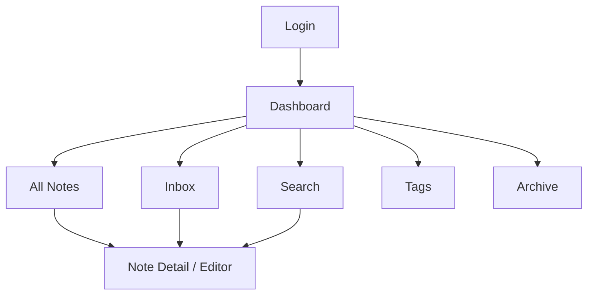
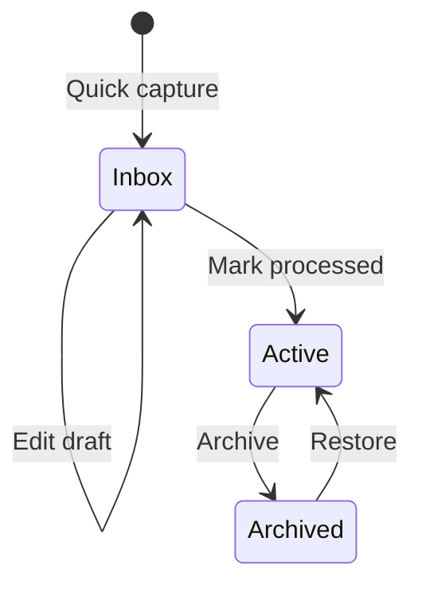

# Desain UI/UX — Second Brain 1.0

## 1. Arah desain

Antarmuka harus terasa tenang, cepat, dan berorientasi pada tulisan. Informasi utama adalah isi note; dekorasi visual tidak boleh mengalahkan konten.

Kata kunci desain: **calm, focused, searchable, connected**.

## 2. Information architecture

## 3. Navigasi utama

| Menu | Tujuan |
|---|---|
| Dashboard | Ringkasan dan quick capture |
| Inbox | Note yang belum diproses |
| All Notes | Seluruh note aktif |
| Search | Pencarian dan filter lanjutan |
| Tags | Daftar tag dan note terkait |
| Favorites | Akses cepat ke note penting |
| Archive | Note yang diarsipkan |

Desktop memakai sidebar tetap. Mobile memakai top bar dengan navigation drawer. Tombol `Quick capture` harus selalu mudah dijangkau.

## 4. Rancangan halaman

### 4.1 Login

- Logo/nama produk.
- Email dan password.
- Show/hide password.
- Pesan error generik.
- Tidak ada link registrasi.

### 4.2 Dashboard

- Sapaan singkat dan tanggal.
- Quick capture input.
- Kartu jumlah Inbox, active notes, tags, dan archived.
- Daftar `Recently updated`.
- Daftar `Favorites`.
- CTA untuk memproses Inbox jika jumlahnya lebih dari nol.

### 4.3 Inbox dan All Notes

- Header, jumlah hasil, search singkat, sort, dan filter.
- Tampilan list menjadi default karena lebih efektif untuk teks.
- Setiap row: judul, cuplikan, tipe, tags, updated time, dan favorite.
- Bulk action tidak masuk MVP.

### 4.4 Note editor/detail

Desktop menggunakan layout dua area: editor/content utama dan panel metadata. Mode edit dapat memakai tab `Write` dan `Preview` untuk menjaga MVP sederhana.

Panel metadata memuat:

- status dan tipe;
- tags;
- source URL bila ada;
- favorite;
- outgoing links;
- backlinks;
- created/updated time;
- archive action.

### 4.5 Search

- Input pencarian dominan dan autofocus.
- Filter status, tipe, tag, dan sort.
- Query/filter tercermin pada URL agar dapat di-refresh atau dibookmark.
- Empty state membedakan “belum mengetik”, “tidak ada hasil”, dan “error”.

## 5. Alur interaksi utama

### Capture ke process

### Membuat hubungan note

1. Owner membuka note.
2. Owner memilih `Add related note`.
3. Combobox mencari note berdasarkan judul.
4. Owner memilih target.
5. Link muncul pada note sumber dan backlink muncul pada note target.

## 6. Design system awal

### Warna

Gunakan neutral/slate sebagai dasar dan indigo sebagai accent. Warna semantic dipakai konsisten untuk success, warning, danger, dan information. Nilai warna final ditentukan saat prototype agar rasio kontras dapat diuji.

### Tipografi

- Sans-serif untuk seluruh UI dan isi note agar implementasi awal konsisten.
- Ukuran body minimum 16 px pada editor.
- Panjang baris konten ideal sekitar 65–80 karakter.
- Hierarki heading jelas, maksimal tiga tingkat pada layout aplikasi.

### Spacing dan bentuk

- Sistem spacing kelipatan 4 px.
- Radius sedang, bayangan tipis, dan border halus.
- Animasi 150–200 ms hanya untuk feedback atau perubahan state.

## 7. Komponen inti

| Komponen | State wajib |
|---|---|
| Button | default, hover, focus, disabled, loading |
| Text input/textarea | default, focus, invalid, disabled |
| Note row/card | default, hover, selected |
| Tag chip | default, selected, removable |
| Combobox | closed, loading, results, no result |
| Dialog | open, submitting, error |
| Toast | success, error, warning |
| Skeleton | list, detail, dashboard |
| Empty state | no data, no result, filtered-empty |

## 8. Responsive behavior

| Viewport | Perubahan |
|---|---|
| 360–767 px | Sidebar menjadi drawer, metadata note menjadi collapsible sheet, action utama tetap terlihat |
| 768–1199 px | Sidebar dapat diperkecil; daftar dan konten memakai lebar fleksibel |
| 1200 px ke atas | Sidebar tetap dan editor memiliki batas lebar baca |

## 9. Accessibility checklist

- Seluruh aksi dapat dicapai dengan keyboard.
- Focus indicator selalu terlihat.
- Icon-only button memiliki accessible name dan tooltip.
- Input selalu memiliki label, bukan placeholder saja.
- Dialog mengunci focus dengan benar dan dapat ditutup memakai Escape.
- Status tidak disampaikan melalui warna saja.
- Heading mengikuti urutan semantik.
- Markdown hasil render menggunakan elemen HTML semantik.

## 10. Copywriting awal

| Kondisi | Teks contoh |
|---|---|
| Inbox kosong | “Inbox sudah rapi. Tangkap ide baru kapan saja.” |
| Belum ada note | “Mulai dengan satu ide, referensi, atau hal yang baru kamu pelajari.” |
| Search kosong | “Ketik minimal dua karakter untuk mencari pengetahuanmu.” |
| Tidak ada hasil | “Belum ada note yang cocok. Coba kata kunci atau filter lain.” |
| Sukses capture | “Tersimpan ke Inbox.” |
| Gagal simpan | “Perubahan belum tersimpan. Coba lagi.” |
